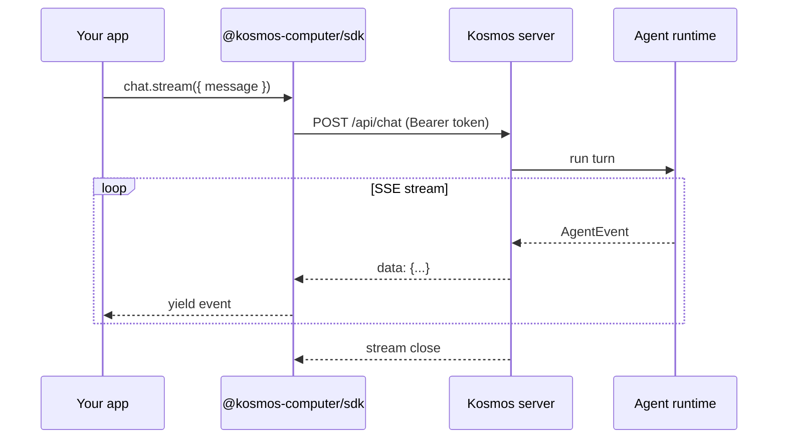

The Kosmos SDK is a **client library** for a running Kosmos environment. It does not embed the agent loop — that lives in the Kosmos server, the same way OpenHands exposes an Agent Server that external clients call.

## Layer model

| Layer | Owner | SDK role |
|-------|-------|----------|
| **Your application** | You | Installs `@kosmos-computer/sdk`, holds credentials |
| **Kosmos server** | Kosmos | Agent loop, tools, sessions, automations, MCP |
| **Arco** | Arco library | Renders generative UI inside the Kosmos shell |
| **Control plane** | Kosmos SaaS | Provisions hosted tenants — **not** part of the SDK |

## Request flow

## Primary API surfaces

### Tier 1 — Agent client (SDK v0.1)

| Route | SDK method | Purpose |
|-------|------------|---------|
| `GET /api/remote/ping` | `client.ping()` | Verify token + connectivity |
| `POST /api/chat` | `client.chat.stream()` | Agent turn (SSE) |
| `GET /api/sessions` | `client.sessions.list()` | List conversation threads |
| `GET /api/sessions/:id` | `client.sessions.get()` | Fetch transcript |
| `POST /api/confirmations/:id` | `client.confirmations.answer()` | Approve/deny gated tools |

### Tier 2 — Platform APIs (planned)

Automations, files, direct tool invoke, shell events. These exist on the Kosmos server today; SDK wrappers will follow in subsequent releases.

### Tier 3 — MCP (alternative path)

External programs can call `POST /mcp` with the same bearer token to reach `os.*` capability intents (calendar, tasks, files) without running a full agent turn. A dedicated `@kosmos-computer/mcp` helper package is planned.

## Comparison with OpenHands SDK

| | **OpenHands SDK** | **Kosmos SDK** |
|---|-------------------|----------------|
| Primary use | Build coding agents in Python | Connect to a Kosmos environment |
| Agent loop | You own it (SDK) | Kosmos server owns it |
| Server role | Optional Agent Server package | Kosmos server *is* the server |
| Streaming | Typed events | `AgentEvent` over SSE |
| Scope | Code execution focus | Full OS: apps, automations, Arco UI |

Kosmos is closer to an **OpenHands Agent Server client** than a **LangChain-style agent builder**.

## Type sync

`@kosmos-computer/types` mirrors the Kosmos server's `shared/types.ts`. On each SDK release, types should be synced from [Kosmos-computer/Kosmos](https://github.com/Kosmos-computer/Kosmos) to avoid drift.

## Instance-scoped URLs

There is no shared `api.kosmos.com`. Each client is configured with one `baseUrl`:

- Local: `http://127.0.0.1:4600`
- Hosted: `https://kosmos-<name>.fly.dev`

Multi-environment orchestration (e.g. chaining Kosmos instances) uses the same protocol — see the kosmos-remote adapter in the Kosmos monorepo.

## Related docs

- [Standards map](/reference/standards-map) — Module 4 (agent surface) defines the event stream
- [Kosmos vs Arco](/guide/kosmos-vs-arco) — product naming
